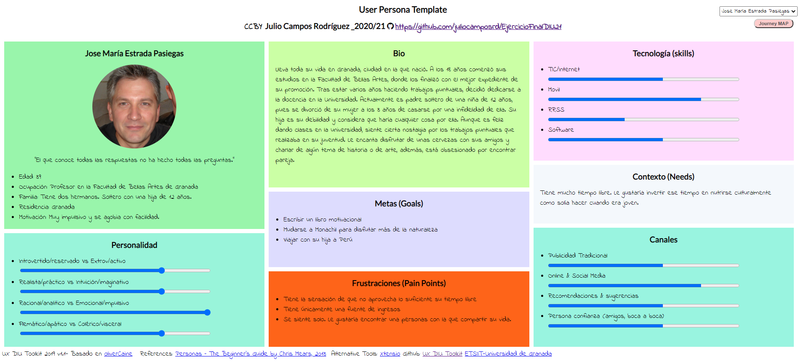
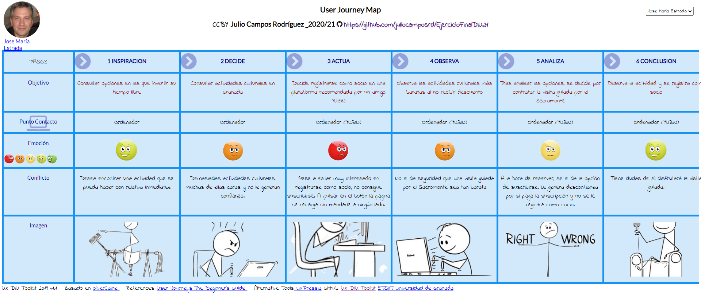
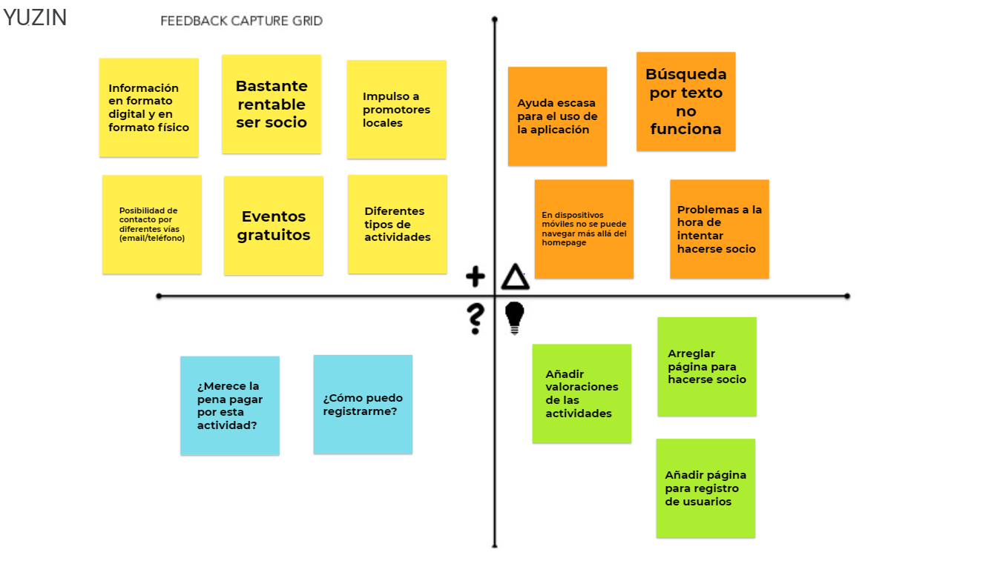
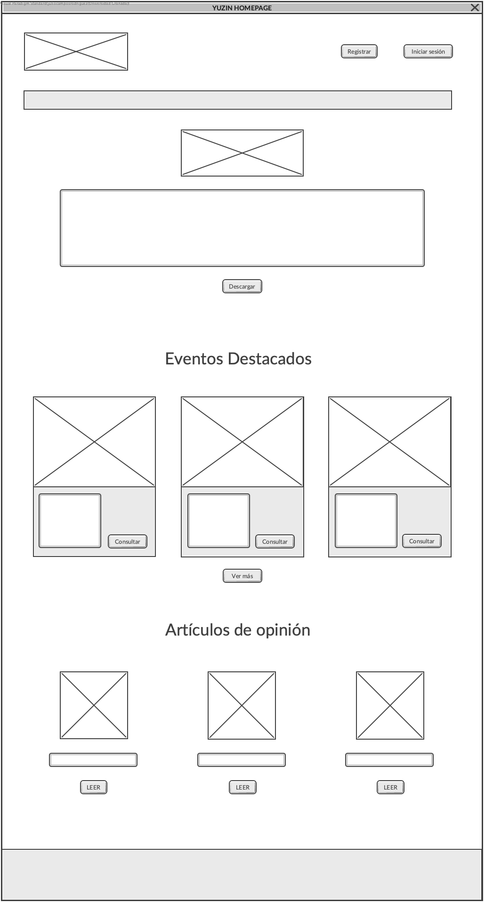
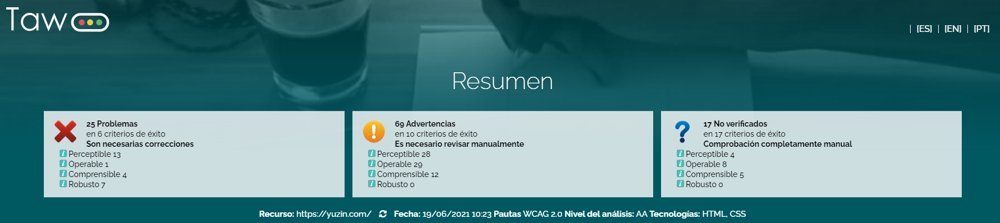

# Ejercicio Final DIU21

Trabajo final de la asignatura Diseño Interfaces de Usuario 2020/2021. Consta de dos partes:
- MI EXPERIENCIA UX.
- Caso de estudio WEB YUZIN.

:bust_in_silhouette: **Autor:** Julio Campos Rodríguez.

# MI EXPERIENCIA UX

Ha sido en Diseño de Interfaces de Usuario donde he tenido mi primera experiencia UX, siendo esta la primera asignatura en la que he podido ver aspectos relacionados con conceptos tales como usabilidad, interfaz de usuario o experiencia de usuario.

A continuación voy a hablar sobre mi experiencia en este ámbito, distinguiendo entre los conocimientos adquiridos en actividades realizadas en la parte teórica y lo que me ha aportado cada una de las prácticas realizadas.

## Actividades de la parte teórica

En las clases de teoría siempre se seguía una metodología similar: se proporcionaba información sobre contenido teórico, tras esto se impartía algún seminario, y en los últimos minutos se realizaba algún ejercicio grupal. Estas actividades realizadas al final de cada clase eran muy variadas, por lo que me voy a centrar en explicar lo que me ha aportado las actividades entregadas “formalmente”.

### **Análisis etnográfico**

En esta actividad se pedía que actuáramos como observadores de algún conflicto de interacción que se diese en la vida real. Esta tarea me permitió adentrarme por primera vez en un proceso de investigación (Desk Research), y concretamente, fue mi primera aproximación a la primera fase de un proceso UX. Me aportó la capacidad de observar mi entorno, detectar un posible fallo de diseño, y la manera en la que podría resolverse dicho error. En conclusión, me ayudó a mejorar mi capacidad analítica, por lo que me resultó bastante satisfactorio realizar esta tarea.

### **Ranking de Usabilidad**
En esta actividad se pedía evaluar a tres universidades andaluzas en términos de usabilidad, abordando aspectos tales como heurísticas, test de rendimiento o una muy pequeña aproximación a la accesibilidad de las mismas.
Personalmente, esta actividad me resultó bastante positiva. El motivo de ello fue la sensación que tuve de que mi capacidad crítica se había visto mejorada al tener que determinar en algunos casos en los que las webs ofrecían características muy similares cuál era mejor o peor. 
Además, ayuda bastante el aplicar algunos conceptos teóricos a aspectos más prácticos, como puede ser evaluar el Wayfinding de diferentes webs.

### **Evaluación Accesibilidad**
En esta actividad se pedía evaluar la accesibilidad de alguna web de un ayuntamiento, siendo esta tarea la que más me ha sorprendido de todas las realizadas en la parte teórica. Me ha ayudado a entender la importancia de realizar no solo un buen diseño, sino también intentando que sea lo más accesible posible. Además, me ha hecho conocer una serie de herramientas como Taw, que permite realizar test de accesibilidad automáticos a las webs. 
Si profundizo en el aspecto más personal, me ha servido para darme cuenta de lo frustrante que puede llegar a ser intentar hacer uso de una web inaccesible simulando algún tipo de discapacidad o problema con herramientas como Web Disability Simulator.

Por último, me gustaría destacar que las actividades realizadas en grupo me han ayudado principalmente a potenciar mis competencias de trabajo en equipo, así como a argumentar mi opinión, escuchar la del resto y encontrar un punto medio.

## Actividades de la parte práctica

### **Primera práctica**

En esta práctica se pidió realizar la primera fase de un proceso UX, que consiste en una investigación sobre una aplicación en cuestión. En el desarrollo de la misma se usaron varias herramientas como un análisis de competidores, personas ficticias, mapas de experiencia o una revisión de usabilidad. 

Las que más me llamaron la atención, y a su vez, las que más me costaron en un principio fueron la de la persona ficticia y su mapa de experiencia, pues era una tarea que no había realizado nunca antes, pero que me ayudaron a comprender la importancia de ponernos en el lugar de diferentes perfiles de usuarios que pueden llegar a usar la aplicación con el objetivo de identificar su experiencia en el uso de la aplicación. Además, al ir avanzando en las prácticas de la asignatura, me di cuenta que siempre se debe tener en cuenta las personas creadas en esta primera fase.

Esta práctica me resultó muy satisfactoria principalmente por un motivo, y es que al ser del doble grado de Ingeniería Informática y Administración y Dirección de Empresas, el ver que una herramienta que había visto en la carrera de empresariales (concretamente en la asignatura de Marketing), que era el análisis de competidores, también tenía cabida en el área de informática me hacía ver la gran relación que tenían ambas carreras.

### **Segunda práctica**

En esta práctica se pedía tener en cuenta las necesidades del usuario para llevar a cabo un proceso de ideación a partir del cual se ofrecería una propuesta de mejora. Las herramientas que empleamos en mi equipo para ello fueron:
- Malla receptora de información: me pareció la herramienta más valiosa de todas por la capacidad de ofrecer información muy importante de una manera muy concisa relativa a aspectos positivos, negativos y propuestas de mejora.
- Canvas: ya la conocía por haber dado clase de Marketing, como he indicado anteriormente.
- Matriz de tareas de usuario: me pareció muy interesante, ya que de la misma manera que en la práctica anterior, conllevaba ponerse en el lugar de diferentes tipos de usuarios para determinar con qué frecuencia se realiza una tarea.
- Análisis de arquitectura de información: me pareció la más pesada de todas.
- Wireframe: aunque a priori no entendía la necesidad de realizar un boceto, en vez de ir directamente a diseñar lo que se pidiese, al llegar a la siguiente práctica fui consciente de su importancia, ya que ayuda a organizar todas las ideas de diseño que se tienen.
  
Me pareció una práctica muy densa, pero muy necesaria para posteriores fases de diseño.

### **Tercera práctica**
En esta práctica se pedía comenzar con el diseño de la que era nuestra propuesta de aplicación para la planificación de viaje. Sin duda es la práctica que más nos ha costado, pero que a su vez, más he disfrutado. Pudimos comprobar todo el trabajo que conlleva el diseñar un simple logo, o la importancia de elegir una correcta paleta de colores que transmitan al usuario el mensaje que queremos mostrar, o que cumplan el test de contraste correspondiente.

Aunque la landing page nos ayudó bastante a profundizar en conocimientos de diseño, fue el Mockup el elemento con el que considero que más he aprendido de la asignatura. El motivo de esto es que no intentábamos hacerlo bonito y ya está, sino que intentábamos tener en cuenta todos los aspectos que habíamos tratado en las fases de diseño anteriores (necesidades de usuarios, propuestas de mejora a aplicaciones concretas, objetivos de la propuesta, etc.), así como nos ayudaba a identificar cada uno de los patrones de diseño que aplicábamos al diseñar el layout.

### **Cuarta práctica**

En esta práctica se pedía evaluar alguna de las propuestas realizadas por alguno de nuestros compañeros en comparación con nuestra propuesta. Me resultó especialmente útil para poder identificar de una manera más clara nuestros puntos fuertes, así como aquellos aspectos que mejoraban nuestros compañeros.

Por último, me gustaría comentar que todas las actividades me han resultado muy útiles para entender aspectos relacionados con el diseño de interfaces de usuario, y que me ha sorprendido bastante la sensación que he tenido de que con cada una de las herramientas que he usado, he aprendido algo que me va a resultar muy útil en el futuro. 

Si tuviese que comentar algo negativo, quizá sería el hecho de que con Adobe XD al principio me encontraba un poco perdido a la hora de usarlo, pero esto se ha visto compensado con lo que he aprendido haciendo uso de dicha herramienta.

# Caso de estudio: Web YUZIN.
YUZIN CLUB CULTURAL es un proyecto que nació como una revista editada cada mes en la que se incluía información relativa a actividades culturales que se daban en algunas ciudades andaluzas. De esta manera, la web YUZIN permitía descargar dicha revista en formato digital.

Fue en 2020 cuando nace el proyecto Yuzin Club Cultural como una plataforma para la promoción de actividades culturales, en la que además de permitir la descarga de la revista, como se hacía en un inicio, toma el rol de club cultural, el cual permite suscribirse al mismo.

Las suscripciones a Yuzin es lo que le permite obtener beneficios, existiendo únicamente un tipo de suscripción, la cual le reporta al suscriptor las siguientes ventajas: descuentos en actividades, recibir la revista en formato físico, newsletter semanal y actividades exclusivas.

La evolución que se ha dado en este proyecto, así como el rediseño del mismo me parece una muy buena idea. Cada vez son menos las personas que buscan información relativa a actividades culturales a través de revistas en formato físico, por lo que dar la posibilidad de descargarla a través de internet en formato pdf permite acceder a dicha información a mucha más gente. No obstante, su punto fuerte es, en mi opinión, el ofrecer la posibilidad de contratar actividades de una manera mucho más rápida, dando la opción de obtener grandes descuentos en las mismas gracias a las suscripciones que ofrecen. Cabe destacar lo positivo que es el hecho de ofrecer un impulso a aquellos promotores culturales que tan mal lo han pasado en estos tiempos de pandemia.

# Proceso de rediseño

## Paso 1. UX Desk Research & Analisis
El objetivo principal de esta fase es evaluar los principios de usabilidad, así como la experiencia del usuario. Para ello se ha propuesto a una persona ficticia, la cual podría ser uno de los usuarios interesados en dichas actividades culturales; se ha desarrollado un mapa de experiencia de usuario con el objetivo de describir la interacción del usuario con YUZIN; y por último, se ha proporcionado una revisión de usabilidad con su correspondiente puntuación.
### **Persona**
Jose María es profesor en la Facultad de Bellas Artes de Granada. Es una persona muy impulsiva, la cual siente bastante nostalgia por las actividades a las que acudía cuando era joven. Actualmente siente que tiene mucho tiempo libre y que no lo aprovecha como debería.

### **Mapa de experiencia**
Se plantea un escenario en el que Jose María busca opciones en las que invertir su tiempo libre, y que una vez barajadas todas ellas, se decide por llevar a cabo una serie de actividades culturales que consulta en una web recomendada por un amigo.

### **Revisión de usabilidad**
Tras hacer el test de usabilidad, éste ha arrojado un resultado de **62 puntos**, situándose en la categoría de **moderado**, es decir, “los usuarios deberían ser capaces de usar esta web así como sus tareas principales, sin embargo, la experiencia de usuario se podría mejorar significativamente”.
En esta revisión de usabilidad, YUZIN obtiene los mejores resultados en el aspecto de su contenido y texto, y los peores resultados en el ámbito de aspectos relacionados con la ayuda.

Puede consultar la revisión [aquí](images/Usability-review.pdf).

## Paso 2. UX Design

A partir de la información extraída de la fase anterior, se obtienen conclusiones sobre las necesidades de los usuarios y las maneras de satisfacerlas. Para ello, en esta fase de diseño se pretende llevar a cabo un proceso de ideación basado en sintetizar los insights y la propuesta de diseño usando una malla receptora de información. Tras ello, se diseñará un prototipo basado en un boceto Lo-Fi de la página principal de la web analizada.

### **Malla receptora de información**

Se ha seleccionado esta herramienta con el objetivo de mostrar de una manera breve y concisa los aspectos positivos, los aspectos negativos, críticas constructivas y posibles preguntas de usuarios, 
de la manera más esquemática posible acorde a la extensión de este ejercicio final.

### **Wireframe**

Se ha diseñado un boceto Lo-Fi de la pantalla que considero más importante para una plataforma de promoción cultural que a su vez es un marketplace. Esta pantalla es la página principal, y en ella se pueden distinguir diferentes partes: una presentación de la misma al inicio, información acerca de los eventos destacados, y por último, información relativa a artículos de opinión.

El motivo por el cual he usado esta herramienta como propuesta de mejora al rediseño llevado a cabo por Yuzin, es nada más y nada menos que para facilitar la tarea que debo realizar a continuación, que es el diseño del mockup. El hacer un boceto Lo-Fi me ayuda a organizar mis ideas, así como a estructurar la pantalla que voy a rediseñar sin entrar demasiado en detalle.

## Paso 3. Prototipado

En esta fase se procederá a crear un prototipo a partir del boceto Lo-Fi desarrollado en la etapa anterior. Para ello, se diseñará un layout Hi-Fi a modo de Mockup haciendo uso de la herramienta Adobe XD.

En esta fase se explicará cómo se ha diseñado el prototipo, qué aspectos se han modificado respecto a los que ya había, los motivos por los que se han hecho, y cómo queda ahora la página principal.

### **Mockup**

Empezaremos a analizarlo de arriba a abajo, comentando los cambios realizados y comparándolos con el diseño actual.

Cómo se puede observar se ha dejado el logo arriba a la izquierda y a la derecha se han añadido dos botones, uno de ellos nos llevará a otra página para el registro del usuario, y el otro botón nos conducirá a otra página para iniciar sesión. Este cambio me ha parecido primordial introducirlo ya que en la página de Yuzin no existe ningún elemento que te permita registrarte como usuario.

Tras esto se mantiene una barra de navegación muy similar a la de la página original, cambiando los siguientes elementos, los cuales en mi opinión, provocaban cierta confusión al no estar bien delimitado su significado:

- “Agenda Cultural” pasa a ser “Actividades Culturales”.
- “Espacios Culturales” pasa a ser “Lugares Culturales”.
- “Asóciate” pasa a ser “Hazte socio”.

Además, se ha cambiado el color de la fuente de cada uno de los elementos de la barra de navegación de marrón a negro, ya que tras hacer el test de contraste éste fallaba con dicha combinación de colores.

Hay ciertos elementos que se han eliminado de la página principal. Éstos son el teléfono de contacto, el cuál ahora aparecería en la página a la que llegaríamos tras pulsar en “Contacta con nosotros”, y la búsqueda de eventos, la cual ahora aparecería en la página de “Actividades Culturales”.

Tras esto, se ha considerado importante explicar a qué se dedica Yuzin Club Cultural, ya que al acceder a la página principal actual cuesta saber cuál es su labor. Además, justo debajo de esta breve presentación se incluye un botón con el que se podrá descargar la revista de Yuzin.

Lo siguiente que aparecerá en la nueva página principal serán los eventos destacados, a diferencia de la página actual, en la que aparecen las opiniones, las cuales son menos relevantes que los propios eventos. En este caso se mantienen las mismas “cartas” que las que hay actualmente, únicamente añadiendo valoraciones acerca de cada evento, que como dije en la malla receptora de información, me parecía una muy buena opción, y se cambia “Experiencias” por “Consultar”, ya que de esta manera se entiende mejor lo que pasa si se pulsa dicho botón. Para aquellos casos en los que se quiera consultar información sobre otros eventos se ha añadido un botón.

Por último, se incluye información muy limitada acerca de los artículos de opinión, con una foto del autor, el título de dicho artículo, y un botón por si se desea leer alguno de ellos.

Además, existe un icono al final de nuestra página para volver al inicio de la misma sin necesidad de hacer scroll vertical. Por otro lado, en el footer se ha añadido información sobre Yuzin, de ayuda, e iconos para poder contactar con la plataforma. Aquí se puede ver mejor con una [demostración](images/redisenio_gif.gif).

Cabe destacar que uno de los principales puntos débiles de Yuzin era la poca ayuda que ofrecía al usuario y lo escondida que estaba en la página principal (footer), para ello se ha incluido un elemento que se mantiene fijo conforme se hace scroll vertical que conducirá al usuario a una página de ayuda.

## Conclusión

Como indiqué al inicio de este estudio, el cambio que ha sufrido el proyecto me parece bastante positivo, así como el rediseño de su página web por lo que he podido ver en la captura que se incluye en el documento proporcionado. No obstante, considero que aún tienen un amplio margen de mejora, ya que existen ciertos puntos como la importancia que se le da a algunos elementos, o errores en la propia página, que lastiman bastante la experiencia de usuario, pudiendo encontrarse el mismo perdido. Algunos de los fallos que he podido ver en la página principal he tratado de resolverlos de la mejor manera posible con el Mockup propuesto.

## Anexo: Test de Accesibilidad
Para finalizar con el estudio de este caso me parece conveniente realizar un test de accesibilidad mediante la herramienta Tawdis.

En cuanto a los problemas que se han detectado en dicho test destacan los siguientes:
- Perceptibles: existe contenido no textual que no dispone de texto alternativo.
- Operable: no queda definido claramente el propósito de un determinado enlace.
- Comprensible: no se incluyen instrucciones en aquellos casos en los que se piden datos al usuario.
- Robusto: contenidos sin label apropiados.
